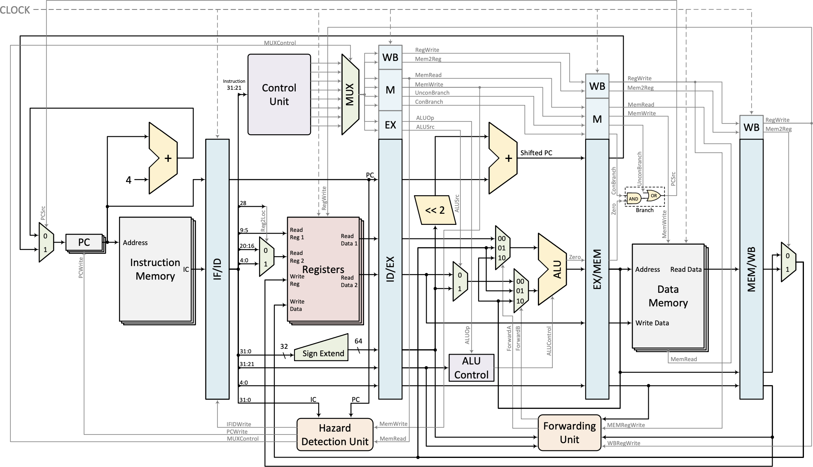
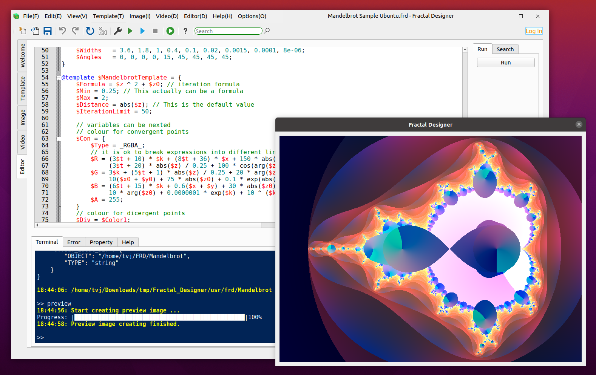
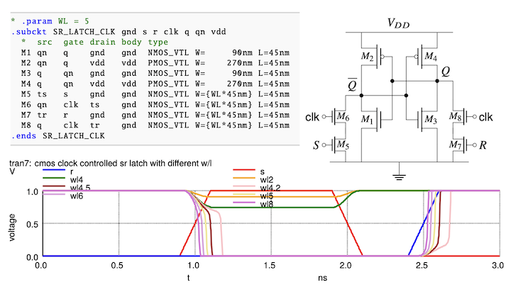
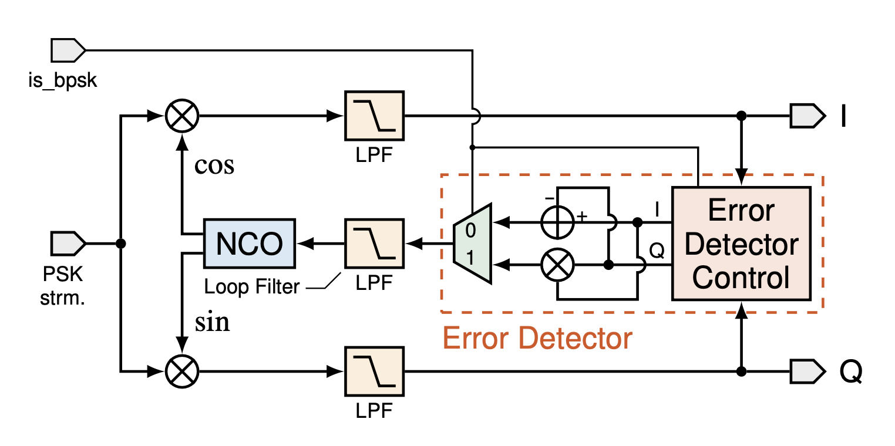
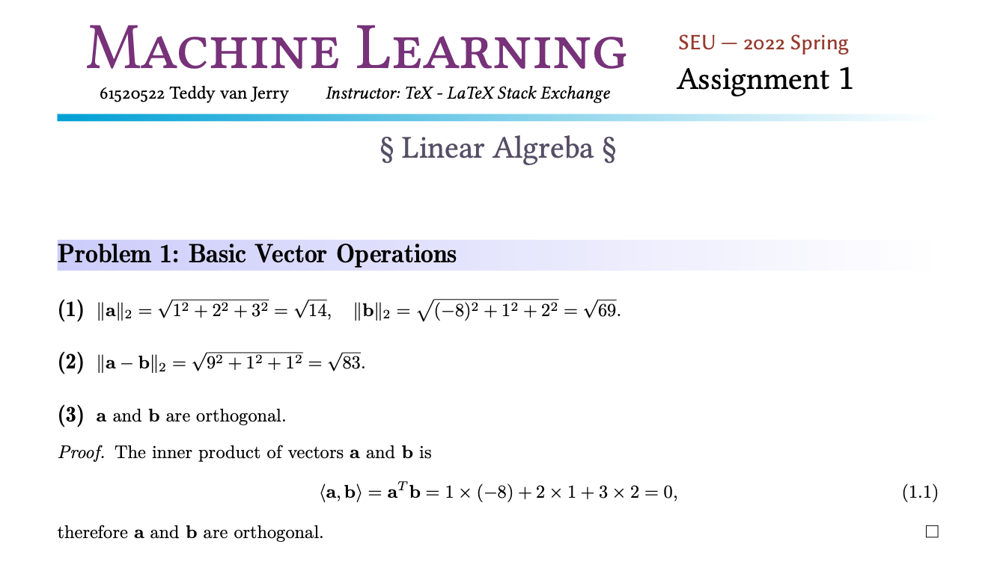

# opengraph.wqzhao.org
Opengraph of [wqzhao.org](https://wqzhao.org).

The following opengraphs are listed in the alphabetical order of their names.
***

## ARM Lite
Link: https://wqzhao.org/projects/arm-lite.

## Dice Simulaion
Link: https://wqzhao.org/projects/dice-simulation.

## FLAMES
Link: https://wqzhao.org/projects/flames.

## Fractal Designer
Link: https://wqzhao.org/projects/fractal-designer.

## mmCEsim
Link: https://wqzhao.org/projects/mmcesim.

## NGSPICE CMOS
Link: https://wqzhao.org/projects/ngspice-cmos.

## PDF2PPT
Link: https://wqzhao.org/projects/pdf2ppt.

## SDR PSK FPGA
Link: https://wqzhao.org/projects/sdr-psk-fpga.

## Sensor Glove
Link: https://wqzhao.org/projects/sensor-glove.

## SEU-ML-Assign
Link: https://wqzhao.org/projects/seu-ml-assign.

## seuthesis2024b
Link: https://wqzhao.org/projects/seuthesis2024b.

